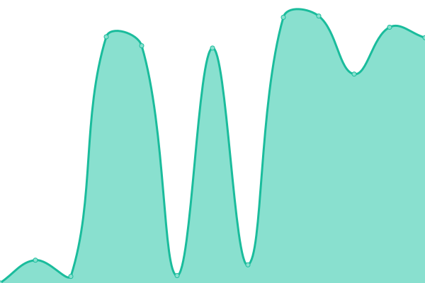

# [📈 Live Status](https://status.pickyzz.dev): <!--live status--> **🟧 Partial outage**

This repository contains the open-source uptime monitor and status page for [Parinya T.](https://pickyzz.dev), powered by [Upptime](https://github.com/upptime/upptime).

With [Upptime](https://upptime.js.org), you can get your own unlimited and free uptime monitor and status page, powered entirely by a GitHub repository. We use [Issues](https://github.com/pickyzz/uptime-monitor/issues) as incident reports, [Actions](https://github.com/pickyzz/uptime-monitor/actions) as uptime monitors, and [Pages](https://status.pickyzz.dev) for the status page.

<!--start: status pages-->
<!-- This summary is generated by Upptime (https://github.com/upptime/upptime) -->
<!-- Do not edit this manually, your changes will be overwritten -->
<!-- prettier-ignore -->
| URL | Status | History | Response Time | Uptime |
| --- | ------ | ------- | ------------- | ------ |
|  [Blog](https://www.pickyzz.dev) | 🟥 Down | [blog.yml](https://github.com/pickyzz/uptime-monitor/commits/HEAD/history/blog.yml) | 

 986ms
     
 | 

<a href="https://status.pickyzz.dev/history/blog">100.00%</a>
    

|  [Opengraph generrate service](https://og.pickyzz.dev) | 🟩 Up | [opengraph-generrate-service.yml](https://github.com/pickyzz/uptime-monitor/commits/HEAD/history/opengraph-generrate-service.yml) | 

 169ms
     
 | 

<a href="https://status.pickyzz.dev/history/opengraph-generrate-service">100.00%</a>
    

|  [comment api](https://comment.pickyzz.dev) | 🟩 Up | [comment-api.yml](https://github.com/pickyzz/uptime-monitor/commits/HEAD/history/comment-api.yml) | 

 3140ms
     
 | 

<a href="https://status.pickyzz.dev/history/comment-api">100.00%</a>
    

<!--end: status pages-->

[**Visit our status website →**](https://status.pickyzz.dev)

## 📄 License

- Powered by: [Upptime](https://github.com/upptime/upptime)
- Code: [MIT](./LICENSE) © [Parinya T.](https://pickyzz.dev)
- Data in the `./history` directory: [Open Database License](https://opendatacommons.org/licenses/odbl/1-0/)
